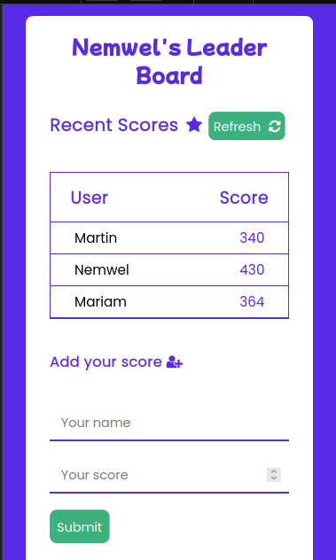
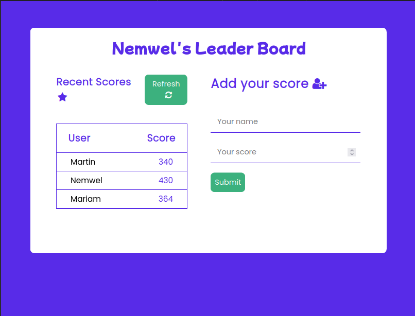
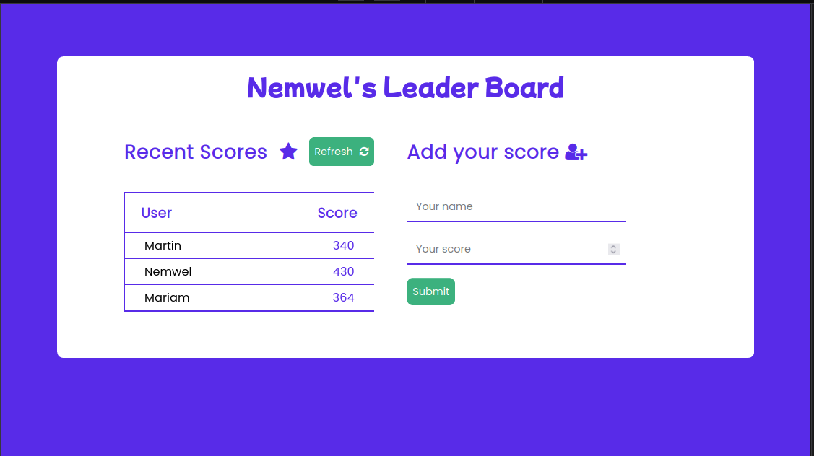

# Nemwel Leader Board

> Nemwel leader board is a simple application that consumes an API and lists people according to their scores.




## How to use my application

When you submit a name and a score to the form, my leaderboard list will not automatically update itself. It requires you to hit the refresh button to fetch all the data from the API. Note that my leaderboard does not sort the scores it just displays them as they are.

## Built With

- HTML-5
- CSS3
- Javacript modules
- Webpack
- Linters

## Live Demo
Live site URL to my Nemwel Leader board
[Live Demo Link](https://nemwel-boniface.github.io/Nemwel-LeaderBoard/)


## Getting Started


- To get a local copy up and running follow these simple example steps.

### Prerequisites

- You only need a browser to run the html file in.

### Setup

- Create a new folder to store the files in.

### Install

- Open your command prompt or terminal and run.
- git clone git@github.com:Nemwel-Boniface/Nemwel-LeaderBoard.git .

### Usage
To use it run the following commands
To get the configurations of the app run ```npm install```
To run the application run ```npm start```


### Run tests

- To run tests run :
 ```npx hint .```
 ```npx stylelint "**/*.{css,scss}"```
``` npx eslint .```

### Deployment

- Project is deployed using
- git push <branch_name>


## Authors

👤 **Author1**

- GitHub: [@Nemwel-Boniface ](https://github.com/Nemwel-Boniface)
- Twitter: [@nemwel_bonie](https://twitter.com/nemwel_bonie)
- LinkedIn: [LinkedIn](https://www.linkedin.com/in/nemwel-nyandoro-aa1b2620b/)


## 🤝 Contributing

Contributions, issues, and feature requests are welcome!

Feel free to check the [issues page](https://github.com/Nemwel-Boniface/Nemwel-LeaderBoard/issues).

## Show your support

Give a ⭐️ if you like this project!

## Acknowledgments
Major thanks to [Nemwel]()


## 📝 License

This project is [MIT](./MIT.md) licensed.